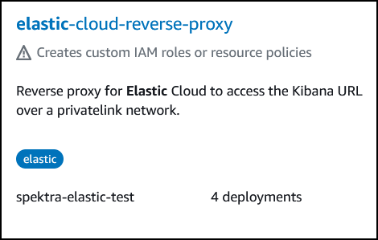
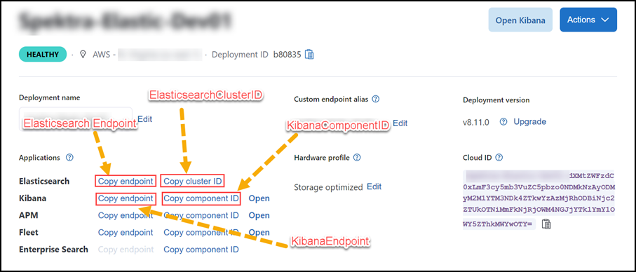
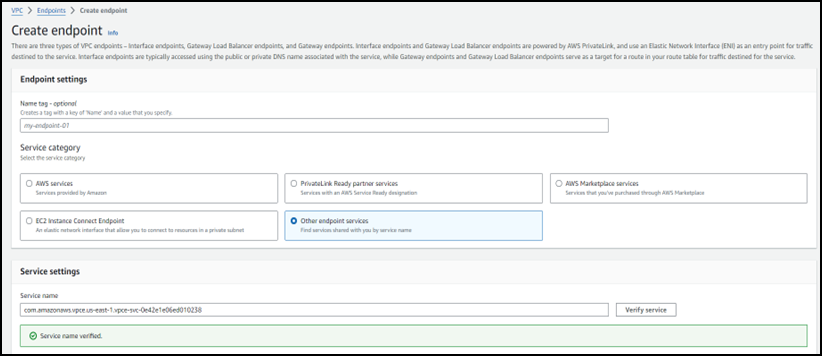
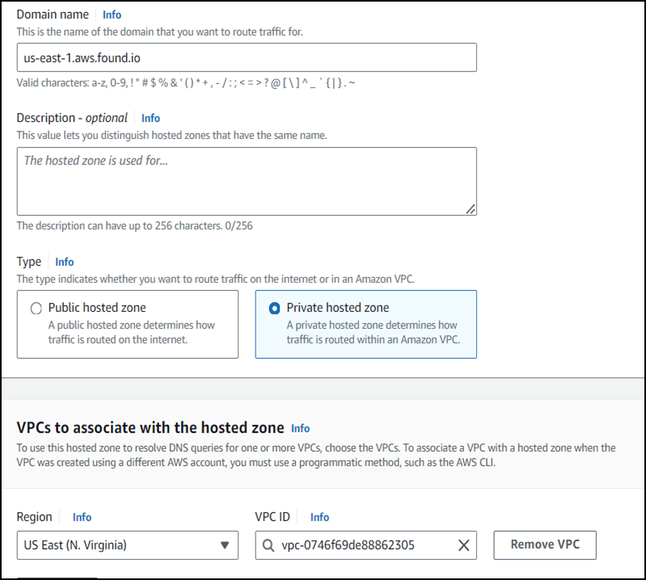
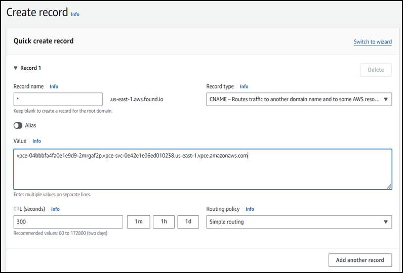
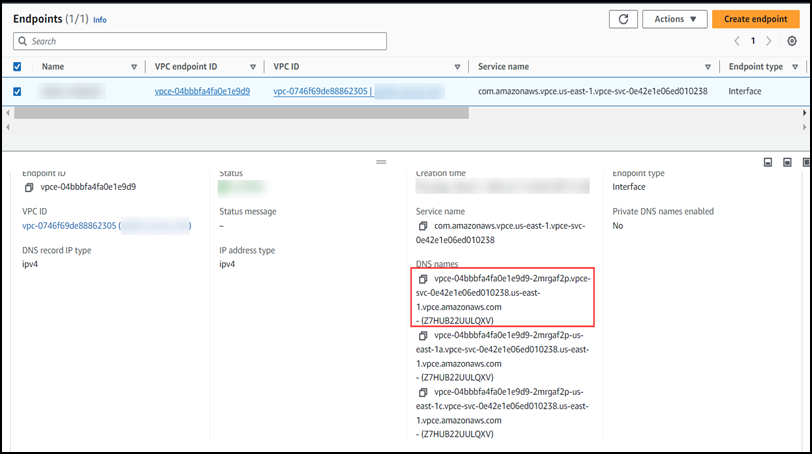

# Elastic Cloud - Reverse Proxy Solution


<!-- TOC -->

1. [Solution Overview](#solution-overview)
2. [Prerequisites](#prerequisites)
3. [Deployment Steps](#deployment-steps)
4. [Deployment Overview and Resource Configuration Details](#deployment-overview-and-resource-configuration-details)
5. [Post Deployment Steps](#post-deployment-steps)


<!-- /TOC -->

## Solution Overview

Elastic Reverse Proxy enables access to the Elastic and Kibana dashboards using a custom domain name that directs to the IP address of an EC2 instance. This is achieved through deployment of the "elastic-cloud-reverse-proxy" application from the AWS Serverless Application Repository.

Upon deployment, the application provisions an EC2 instance configured to act as a reverse proxy, facilitating secure access to the Elastic and Kibana dashboards. This reverse proxy ensures that requests from the custom domain are routed to the appropriate endpoints, maintaining security and network isolation.

## Prerequisites

Before deploying the *elastic-cloud-reverse-proxy* application, ensure the following requirements are met:

1. **Public Domain Name (Required):**
    - a public domain name hosted by any cloud or third-party provider, such as "clouddemo.com".

1. **Custom Domain Names for Dashboard Access (Required):**
    - To access the Kibana and Elastic dashboards, two custom domain names are required:
    - One for accessing the Kibana dashboard (e.g., kibana.clouddemo.com).
    - One for accessing the Elastic dashboard (e.g., elastic.clouddemo.com).

1. **Subnet ID for EC2 Instance Deployment (Required):**
    - Ensure availability of a Subnet ID for deploying the EC2 instance. This subnet should have internet access as certain packages are downloaded during the execution of user data scripts. Additionally, utilize this subnet to create a VPC endpoint for the Elastic PrivateLink service.

1. **VPC ID for Security Group Attachment (Required):**
    - VPC ID for the security group that will be attached to the EC2 instance.

1. **Pre-logged-in Setup for Kibana Dashboard Access (Optional):**
    - If accessing the Kibana dashboard without the need for entering credentials is desired, an additional custom domain can be configured. For instance, "anonymous.clouddemo.com".
    - It is necessary to have the username and password for Elastic deployment readily available.

## Deployment Steps

### Deploying elastic-cloud-reverse-proxy from AWS SAR -

To deploy the elastic-cloud-reverse-proxy application via AWS Serverless Application Repository (SAR), follow these steps using the AWS Management Console:

1. Login to AWS Console.

1. Open the AWS ***Serverless Application Repository*** from the services menu. Click on "Available applications" tab to browse through the available applications.

1. Under the Public Application section, ensure to check the box labeled "Show apps that create custom IAM roles or resource policies" to include applications with custom IAM roles or resource policies.

1. In the serverless application repository, search and click on application ***elastic-cloud-reverse-proxy***.

    

1. Once you click the application, scroll down in the application page and fill the application settings as mentioned below. Once the required information is provided under application settings, you are ready to deploy the application.

    - **Application name (required):** 
        - The stack name of this application created via AWS CloudFormation. You can leave the value as default.

    - **ElasticEC2SubnetID (required):**
        - Subnet ID for deploying the EC2 instance.
        - Ensure the subnet has internet access for configuring the EC2 instance using user data script.

    - **ElasticEC2VPCID (required):**
        - VPC ID is essential for creating the security group associated with the EC2 instance.
        - This security group defines inbound and outbound rules governing network traffic.

    - **ElasticSearchCustomDomainURL (required):**
        - Publicly accessible custom domain URL used for accessing the Elasticsearch deployment.

    - **ElasticsearchClusterID (required):**
        - Cluster ID associated with Elasticsearch deployment.

    - **ElasticsearchEndpoint (required):**
        - URL of the Elasticsearch endpoint associated with the deployment.

    - **ElasticsearchPassword (Optional):**
        - Password required for accessing the Elasticsearch deployment.
        - This parameter is optional and is required only if users choose to enable anonymous access to the Kibana dashboard, utilizing pre-signed custom URLs.
        - Specify a value only if you opt to enable anonymous access to the Kibana dashboard by selecting "Yes" for the KibanaAnonymousAccess parameter.

    - **ElasticsearchUsername (Optional):**
        - Username required for accessing the Elasticsearch deployment.
        - This parameter is optional and is required only if users choose to enable anonymous access to the Kibana dashboard, utilizing pre-signed custom URLs.
        - Specify a value only if you opt to enable anonymous access to the Kibana dashboard by selecting "Yes" for the KibanaAnonymousAccess parameter.

    - **KibanaAnonymousAccess (Optional):**
        - Allows users to specify whether they wish to access the Kibana pre-logged-in dashboard from a custom domain name without requiring the entry of a username and password.
        - If users choose to enable pre-logged-in access to the Kibana dashboard, they should set the value as "Yes".
        - The default value for this parameter is set to "No".
        - Ensure the availability of a custom domain name designated for accessing the pre-logged-in Kibana dashboard.

    - **KibanaComponentID (required):**
        - Component ID associated with Elasticsearch deployment.

    - **KibanaCustomDomainURL (required):**
        - Publicly accessible custom domain URL used for accessing the Kibana dashboard.

    - **KibanaEndpoint (required):**
        - URL of the Kibana endpoint associated with the deployment.

    - **KibanaPreloggedInDashboardCustomDomainURL (Optional):**
        - Publicly accessible custom domain URL used for accessing the pre-logged-in Kibana dashboard.

        **Note:** KibanaAnonymousAccess parameter must be set to "Yes". Additionally, valid username and password credentials for Elastic deployment are required.


    Please refer to the attached screenshot for obtaining the ElasticsearchEndpoint (Elastic Endpoint URL), ElasticsearchClusterID (Elastic Cloud ID), KibanaEndpoint (Kibana Endpoint URL), KibanaComponentID (Kibana Component ID) details from the Elastic dashboard:

    


    After configuring the parameters, proceed with the deployment process. Review the summary and confirm the deployment. Ensure to check the box labeled “I acknowledge that this app creates custom IAM roles, resource policies and deploys nested applications” to acknowledge the creation of custom IAM roles and resource policies during the deployment process and click on ***Deploy***.

1. Monitor the deployment progress in the AWS CloudFormation console and check if all the resources are successfully deployed.


## Deployment Overview and Resource Configuration Details

The ***elastic-cloud-reverse-proxy*** application orchestrates the deployment of an AWS Lambda function. This Lambda function, in turn, creates a supplementary stack responsible for provisioning the following resources:

- **EC2 Instance:** An EC2 instance is instantiated, with an updated nginx.conf file to serve as a reverse proxy for Elastic Cloud and Kibana dashboard.

- **Security Group for EC2 Instance:** A security for an EC2 instance.

- **Key Pair Association:** A key pair is associated with the EC2 instance.


## Post Deployment Steps

Upon successful deployment of the application, follow these steps:

1. **Obtain the Public IP Address of the EC2 Instance and Update DNS Records:**
    - Upon successful deployment, retrieve the public IP address associated with the EC2 instance. Subsequently, use this IP address to update the DNS records for the custom domain names, including those designated for accessing Elastic, Kibana, and any optional pre-logged-in custom domain names for anonymous access. 
    - Add Type A records pointing to the obtained public IP address, ensuring proper routing of traffic and seamless access to the associated services via the specified custom domain names.

        *Note:* Before creating SSL certificates, it is required to ensure that the **custom domain names are correctly pointed to the public IP address of the EC2 instance.** This is essential for the SSL certificate issuance process.

1. **Generate SSL Certificates for Custom Domains:** 
    - After updating the DNS records, proceed to generate SSL certificates for the custom domain names. If SSL certificates are not already available for the custom domain names, follow these steps:

        *Note:* If you already have SSL certificates, you can skip this step and proceed to step number 3.

        - **Access the Ubuntu EC2 Instance:**
            - Log in to the Ubuntu EC2 instance using EC2 Instance Connect, which allows access to the instance via a web browser.


        - **Generate SSL Certificates:**
            - Execute the following command on the Ubuntu EC2 instance to generate SSL certificates for each custom domain name:

                ```
                sudo certbot certonly --non-interactive --standalone --agree-tos --email abc@gmail.com -d custom_domain
                ```

            *Note:* Ensure to rerun this command for each custom domain.

            - Replace **"custom_domain"** with the respective custom domain used during application deployment, such as "kibana.clouddemo.com" and provide a **valid email address** to receive notifications regarding certificate expiration.

            - This command initiates the SSL certificate generation process using Certbot in standalone mode. After successful execution, SSL certificates will be generated for the specified custom domain name, enabling secure communication between clients and the server.

        - **Check Nginx Status & Restart:**
            - To verify if the configuration is valid, execute the following command:

                ```
                nginx -t
                ```

            - Subsequently, restart Nginx using the following command:
                ```
                systemctl restart nginx
                ```

1.  **Updating Nginx Configuration for Existing SSL Certificates:** 
    - If you already possess SSL certificates for custom domains, store them in a directory on your Ubuntu instance. Follow the steps outlined below to update the Nginx configuration:

        - **Store SSL Certificates:**
            - If you have SSL certificates for the custom domains, store them in a directory on your Ubuntu VM.

        - **Locate Nginx Configuration File:**
            - Open the `nginx.conf` file located at `/etc/nginx/nginx.conf` using editor.

        - **Update SSL Certificate Paths:**
            - For each custom domain, update the SSL certificate paths in the server block corresponding to that domain. Replace the placeholders **`ssl_certificate`** and **`ssl_certificate_key`** with the file paths where your SSL certificate files are stored.

                ```
                nginx
                    server {
                        listen 443 ssl;
                        server_name custom_domain.com;

                        ssl_certificate /path/to/your/fullchain.pem;
                        ssl_certificate_key /path/to/your/privkey.pem;

                        location / {
                            # Your location block configuration
                        }
                    }
                ```

                **ssl_certificate:** Specifies the file path of the SSL certificate file (`fullchain.pem`) for the custom domain.

                **ssl_certificate_key:** Specifies the file path of the private key file (`privkey.pem`) corresponding to the SSL certificate.

        - **Save and Close the File:**
            - After making the necessary changes, save the **`nginx.conf`** file and exit the text editor.

        - **Check nginx Status & Restart:**
            - To verify if the configuration is valid, execute the following command:
                
                ```
                nginx -t
                ```

            - Subsequently, restart Nginx using the following command:
                
                ```
                systemctl restart nginx
                ```

1. **Configure Security Group for VPC Endpoint:**
    - Create a security group for the VPC endpoint to facilitate the necessary traffic. Ensure that the security group allows inbound traffic on port 443 and port 9243.

1.  **Create Private Endpoint for Elastic Private Link Service:**
    - Create a private endpoint specifically for the Elastic Private Link service. Utilize the subnet ID specified as a parameter during deployment. This ensures seamless and secure connectivity to the Elastic resources within the designated VPC.
    - For the region where you deployed the application, please refer to the official Elastic Search documentation [Elastic PrivateLink](https://www.elastic.co/guide/en/cloud/current/ec-traffic-filtering-vpc.html) to retrieve the VPC Service Name. This information can be found under the heading ***"PrivateLink service names and aliases".***
    - Follow the steps to create VPC endpoint for elastic privatelink service.
        - Create a VPC endpoint in your VPC using the service name for your region.
            
            

        - The security group for the endpoint should at minimum allow for inbound connectivity from your instances CIDR range on ports 443 and 9243.

1. **Configure Route 53 Hosted Zone:**
    - Create the Route 53 hosted zone to ensures proper DNS resolution and facilitates access to the Elastic and Kibana dashboards via the configured custom domain names.
    - While creating the ***private hosted zone*** for the VPC specified during application deployment in the us-east-1 region, use "**us-east-1.aws.found.io**" as the domain name. If deploying in a different region, replace "us-east-1" with the respective region and create the hosted zone with the format "**region.aws.found.io**".
    - Don’t forget to associate the private hosted zone with your VPC.
    - Follow the steps to create private hosted zone & add record set.
        - Create private hosted zone for the VPC in the region.

            

        - Create a DNS CNAME alias directed towards the PrivateLink Endpoint. Add this record to a private DNS zone within your VPC. Utilize "*" as the record name and input the DNS name of the VPC endpoint as the value.

            

        - You can obtain the value for this record from the VPC endpoint.

            

1. **Traffic Filtering:**
    - For detailed instructions on configuring EC Traffic Filtering, please refer to the [Official Elastic documentation](https://www.elastic.co/guide/en/cloud/current/ec-traffic-filtering-vpc.html). Under the section titled ***"Add the private link rules to your deployments,"*** you will find step-by-step guidance.


Upon completing this setup, you can now access the custom domain name via your browser, which will seamlessly redirect you to the Elastic deployment. Despite the application of traffic filtering measures, secure access to the Elastic and Kibana dashboards is ensured. 


